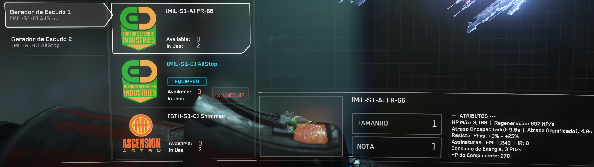
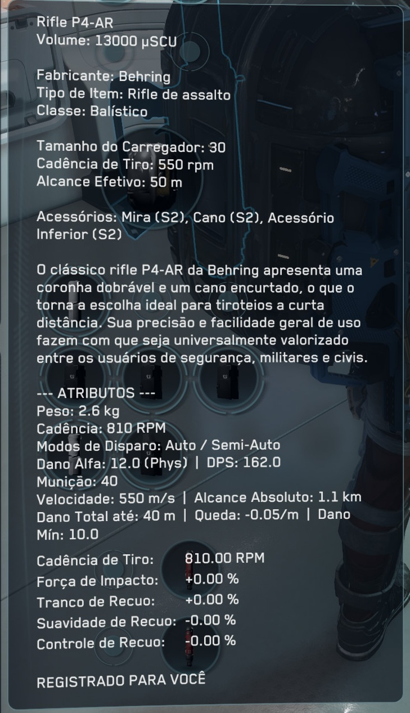
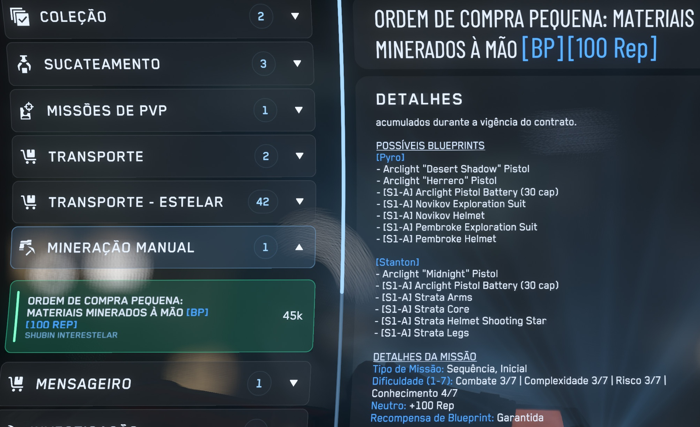

# lazy-citizen-enhancements

[](https://github.com/altibola/lazy-citizen-enhancements/actions/workflows/check-translations.yml)
[](https://github.com/altibola/lazy-citizen-enhancements/actions/workflows/translate-enhancements.yml)

Generates enhanced `global.ini` localization files for Star Citizen by merging
community translations with auto-generated stat overlays (ships, weapons,
missions, components).

## Quickstart (players)

Open **PowerShell** and run:

```powershell
irm "https://raw.githubusercontent.com/altibola/lazy-citizen-enhancements/LIVE/install_translation.ps1?$(Get-Random)" | iex
```


### How the installer works:
1. **Detects Star Citizen folder**: Checks current directory → RSI Launcher logs → default installation path (asks if not found). Run it from inside a channel folder (e.g. `StarCitizen\PTU`) to target that channel; otherwise it targets **LIVE**.
2. **Language selection**: Allows you to pick your preferred community translation (e.g. Português - danielgmota, Português - Dymerz, Français, Español, Italiano).
3. **Translating enhancements / stats (`[S/n]`)**:
   - **`S` (Sim / Yes — Recommended)**: Installs the **`*_all`** variant where stat labels and overlays (Armor HP, Shield Regen, DPS, Weapon Fire Rate, Crafting info, etc.) are translated into your chosen language.
   - **`n` (Não / No)**: Installs the standard version with stat labels left in their original English format (`Armor HP:`, `Regen:`, etc.).
4. **Auto-configuration**: Downloads the correct `global.ini` to `data\Localization\<language>\global.ini` and automatically updates `g_language` in `user.cfg`.

## Version status

<!-- VERSION-STATUS:START -->

_Last verified: **2026-08-27 22:25 UTC** — refreshed automatically by the pipeline and the **Update community translations** workflow._

| Source | Pinned (this repo) | Upstream HEAD | Status |
|---|---|---|---|
| Game build (P4CL) | `4.10.0-live-12519617` <br/> `(P4CL: 12519617)` | — | — |
| french — `Dymerz/StarCitizen-Localization@main` | [`03b9918`](https://github.com/Dymerz/StarCitizen-Localization/commit/03b991854888648068ab2e63038d9f79feb5f9d6) | `03b9918` | ✅ up to date (pinned at build) |
| italian — `Dymerz/StarCitizen-Localization@main` | [`03b9918`](https://github.com/Dymerz/StarCitizen-Localization/commit/03b991854888648068ab2e63038d9f79feb5f9d6) | `03b9918` | ✅ up to date (pinned at build) |
| portuguese_br — `danielgmota/StarCitizen-Localization@develop` | [`3d9363e`](https://github.com/danielgmota/StarCitizen-Localization/commit/3d9363ec2c58a75707e3cf3be8e95b7196c3ed39) | `3d9363e` | ✅ up to date (pinned at build) |
| portuguese_br_dymerz — `Dymerz/StarCitizen-Localization@main` | [`03b9918`](https://github.com/Dymerz/StarCitizen-Localization/commit/03b991854888648068ab2e63038d9f79feb5f9d6) | `03b9918` | ✅ up to date (pinned at build) |
| spanish — `Thord82/Star_citizen_ES@main` | [`56d99dc`](https://github.com/Thord82/Star_citizen_ES/commit/56d99dc9c8e75e20d6291419c742aa7d0d1c61ca) | `56d99dc` | ✅ up to date (pinned at build) |

<!-- VERSION-STATUS:END -->

## In-game Preview

Here is how the enhancements, stats, and translated mission details look in-game:

| Component & Loadout Stats | Weapon Inspect Stats | Mission Details |
| :---: | :---: | :---: |
|  |  |  |

## Downloads

<!-- DOWNLOADS:START -->

Current build: **`12519617`** (LIVE) — this table is regenerated automatically by the pipeline (`versions_report.py`); see [VERSIONS.md](VERSIONS.md) for the full input/output version manifest.

| Language | Game build | Enhanced file |
|---|---|---|
| English | `12519617` (LIVE) | [global.ini](data/Localization/english/global.ini) |
| French (France) | `12519617` (LIVE) | [global.ini](data/Localization/french_%28france%29/global.ini) |
| French (France) — stats translated | `12519617` (LIVE) | [global.ini](data/Localization/french_%28france%29_all/global.ini) |
| Italian (Italy) | `12519617` (LIVE) | [global.ini](data/Localization/italian_%28italy%29/global.ini) |
| Italian (Italy) — stats translated | `12519617` (LIVE) | [global.ini](data/Localization/italian_%28italy%29_all/global.ini) |
| Portuguese (Brazil) | `12519617` (LIVE) | [global.ini](data/Localization/portuguese_%28brazil%29/global.ini) |
| Portuguese (Brazil) — stats translated | `12519617` (LIVE) | [global.ini](data/Localization/portuguese_%28brazil%29_all/global.ini) |
| Portuguese (Brazil) — dymerz | `12519617` (LIVE) | [global.ini](data/Localization/portuguese_%28brazil%29_dymerz/global.ini) |
| Portuguese (Brazil) — dymerz — stats translated | `12519617` (LIVE) | [global.ini](data/Localization/portuguese_%28brazil%29_dymerz_all/global.ini) |
| Spanish (Spain) | `12519617` (LIVE) | [global.ini](data/Localization/spanish_%28spain%29/global.ini) |
| Spanish (Spain) — stats translated | `12519617` (LIVE) | [global.ini](data/Localization/spanish_%28spain%29_all/global.ini) |

<!-- DOWNLOADS:END -->

Install: copy the desired language folder to your Star Citizen installation —

```
StarCitizen/LIVE/data/Localization/<language>/global.ini
```

and confirm `user.cfg` contains:

```
g_language = portuguese_(brazil)   # adjust to your language
```

## Version guarantees

Every release records the exact versions it was built from:

- **[VERSIONS.md](VERSIONS.md)** — game build (P4CL), the pinned upstream
  commit of each community translation (with permalinks) and exactly which
  inputs the enhancement generator consumed, plus per-file output hashes.
- **`enhancements/version.json`** — machine-readable equivalent, used by the
  automation to detect upstream translation updates.
- **`enhancements/<lang>/enhancements/provenance.json`** — full per-language
  input/output chain with SHA-256 hashes.

## How it works

Three flows by design:

### 1. Full build local + online (recommended)

You run locally only what requires your Star Citizen installation. GitHub Actions takes care of the rest (community translations, glossary translation, PR creation).

```
RSI Launcher installs game
    └─ ./src/runall.sh           (extracts Data.p4k, generates enhancements, commits)
        └─ build-from-extraction.yml  (online: downloads translations, creates PR)
```

1. RSI Launcher downloads and installs the patch normally.
2. `./src/runall.sh` (or `python src/run_pipeline.py`) extracts and generates the enhancement files.
3. Commits and pushes `enhancements/`.
4. Triggers the **Build from local extraction** workflow → translates + creates PR.

### 2. Full build 100% online (requires RSI credentials in GitHub Secrets)

The **Download build (hosted)** workflow authenticates against the RSI CDN and does everything without a local game installation. See [docs/download-runner.md](docs/download-runner.md).

### 3. Translation refresh (CI — without game files)

When a community translation is updated upstream, the **Update community translations** workflow re-runs only the download + merge (`--skip-extract --skip-generate`), re-using the `*_enhancements.ini` files already present in the branch. If nothing changed, it commits nothing.

When a PTU build becomes LIVE, the **Promote build to LIVE** workflow merges the `build/{p4cl}` branch into `LIVE`.

## Workflows (all on-demand — `workflow_dispatch`)

| Workflow | Description | When to use |
|---|---|---|
| **Build from local extraction** | Downloads community translations and opens PR; reuses locally committed `enhancements/`. | After `./src/runall.sh` + push |
| **Download build (hosted)** | Full pipeline on a GitHub runner via RSI CDN. Requires `RSI_USERNAME`/`RSI_PASSWORD` in Secrets. | New patch, no local installation |
| **Update community translations** | Checks if upstream translations changed; re-merges and commits when updated. | Translation updates |
| **Translate enhancement texts** | Applies glossaries and rebuilds `*_all*` variants. | After editing glossaries |
| **Promote build to LIVE** | Opens PR (or auto-merges) `build/{p4cl}` → `LIVE` when build goes LIVE. | PTU → LIVE |


## Translating the generated texts (`*_all` variants)

The stat blocks are generated with English labels. `src/translate_enhancements.py`
translates them with committed, user-editable glossaries — no external
translation service:

| File | Role |
|---|---|
| `translations/glossaries/<g>.json` | Label translations (`"Crew:" → "Tripulação:"`). Edit freely. |
| `translations/overrides/<g>.ini` | Full custom translation for specific keys — wins over the glossary. |
| `translations/pending/<g>.json` | *Generated*: terms the glossary didn't cover. Copy them into the glossary to translate. |
| `enhancements/<lang>/enhancements_translated/` | *Generated*: the post-glossary INIs (intermediate, inspectable). |
| `data/Localization/<id>_all/` | Final fully-localized variant. |

```bash
python src/translate_enhancements.py            # all configured languages
python src/translate_enhancements.py --check    # coverage report only
# or via helper script:
./src/translate.sh
```

## Development Setup

To set up the development environment on Windows (via Git Bash) or Linux/macOS:

```bash
./src/bootstrap.sh        # creates .micromamba env and configures Smart Citizen (once)
```

## Development Usage (Git Bash / Linux / macOS)

Automation and development scripts are located in the `src/` directory:

```bash
# Full pipeline from local p4k (extraction + generation + merge):
python src/run_pipeline.py --p4k "/path/to/StarCitizen/LIVE/Data.p4k"
python src/run_pipeline.py --p4k "..." --lang portuguese_br   # single language

# Re-merge only (CI mode / translation update):
python src/run_pipeline.py --skip-extract --skip-generate

# Glossary translation (*_all* variants):
./src/translate.sh

# Create branch build/{p4cl} + PR:
python src/create_pr.py

# Run everything at once:
./src/runall.sh --p4k "/path/to/StarCitizen/LIVE/Data.p4k"
```

## Adding languages

1. Add entries to `LANGUAGE_GITHUB_INFO` and `SC_LANGUAGE_IDS` in
   [`src/lang_sources.py`](src/lang_sources.py).
2. (Optional) To get a fully-translated variant, add the language to
   `ENHANCEMENT_TRANSLATIONS` in
   [`src/translate_enhancements.py`](src/translate_enhancements.py) and create its
   glossary under `translations/glossaries/`.

## Projects used

| Project | Repository | Role |
|---|---|---|
| **Smart Citizen** | [Osiris-DevWorks/smart-citizen](https://github.com/Osiris-DevWorks/smart-citizen) | Enhancement engine (generator + merger), fetched at setup time |
| **Dymerz** | [Dymerz/StarCitizen-Localization](https://github.com/Dymerz/StarCitizen-Localization) | Base translations: French, Spanish, PT-BR (`main`) |
| **danielgmota** | [danielgmota/StarCitizen-Localization](https://github.com/danielgmota/StarCitizen-Localization) | Alternative PT-BR base translation (`develop`) |

See [NOTICE](NOTICE) for Smart Citizen attribution (Apache 2.0).

## Maintenance

```bash
./src/clean.sh            # remove out/, *.log, __pycache__
./src/clean.sh --deep     # also removes .smart-citizen/  → restore with ./src/setup_smart_citizen.sh
./src/clean.sh --full     # also removes .micromamba/     → restore with ./src/bootstrap.sh
```

## Requirements

- **Full build, local Windows**: .NET Framework 4.x (`unp4k.exe`/`unforge.exe`),
  Star Citizen install or RSI credentials for `--download`
- **Full build, local Linux/macOS**: `dotnet` runtime (unp4k/unforge DLL builds,
  fetched automatically at setup) + RSI credentials for `--download`
- **Full build, hosted runner**: nothing local — see
  [docs/download-runner.md](docs/download-runner.md)
- **Translation refresh (CI)**: plain Python 3.11, no game files

## License

Apache License 2.0 — see [LICENSE](LICENSE) and [NOTICE](NOTICE).  
Unofficial community project; not affiliated with Cloud Imperium Games or RSI.

